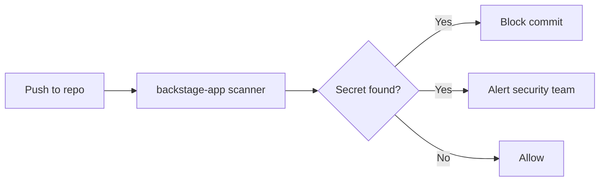

# backstage-app

Secret scanning

## Architecture


```mermaid
flowchart LR
    A[Push to repo] --> B[backstage-app scanner]
    B --> C{Secret found?}
    C -->|Yes| D[Block commit]
    C -->|Yes| E[Alert security team]
    C -->|No| F[Allow]
```

## Getting Started

```bash
go build -o backstage-app .
./backstage-app
```

## Development

```bash
make build
make test
make lint
```
